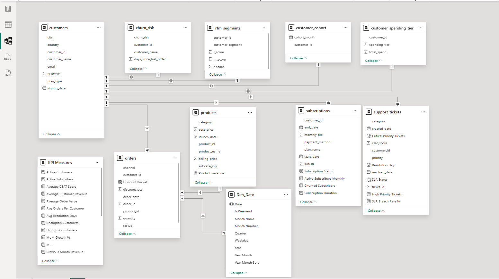

# StreamCart Analytics Platform

### Enterprise Business Intelligence Solution for a Subscription-Based E-Commerce Business

Built by **Gaurika Dhingra** : Data Analytics | Business Intelligence | Product Analytics

---

## Overview

StreamCart Analytics is an end-to-end Business Intelligence platform built to transform raw operational data into decision-ready executive intelligence. The project covers the full BI lifecycle: data modeling, data quality auditing, KPI engineering, advanced analytics (RFM, cohort, churn, Pareto), dimensional modeling, and a 5-page interactive Power BI dashboard suite.

The project demonstrates how an enterprise Business Intelligence solution can be designed, audited, modeled, analyzed, and visualized to support executive decision-making within a subscription-based e-commerce environment.

**Analysis Period:** January 2023 – June 2025

---

## Business Objective

StreamCart needed a centralized analytics platform to answer:

| Domain | Key Questions |
|---|---|
| **Revenue & Profitability** | How is revenue evolving? Which categories/channels drive the most profit? |
| **Customer Intelligence** | Who are our most valuable customers? Who's at risk of churn? |
| **Product Performance** | Which products/categories drive growth? How concentrated is revenue? |
| **Subscription & Retention** | Which plans drive recurring revenue? How healthy is retention? |
| **Support Operations** | How fast and how well are we resolving tickets? Are we meeting SLAs? |

---

## Solution Architecture

```text
Raw Operational Data
(Customers, Orders, Products, Subscriptions, Support Tickets)
            ↓
MySQL Database
            ↓
SQL Audit & Data Quality Layer
            ↓
Data Remediation Layer
            ↓
Business KPI Layer
            ↓
Advanced Analytics Layer
(RFM Segmentation, Cohort Analysis, Churn Risk Modeling, Pareto Analysis)
            ↓
Power BI Star Schema Semantic Model
            ↓
DAX Measures & Time Intelligence
            ↓
Executive Decision Dashboards (5 Pages)
```

---

## Dataset Summary

| Table | Records |
|---|---|
| Customers | 500 |
| Orders | 5,000 |
| Products | 100 |
| Subscriptions | 300 |
| Support Tickets | 1,000 |

---

## Data Quality & Audit Layer

A dedicated SQL audit framework was implemented **before** any KPI or dashboard work began, data integrity was treated as a prerequisite, not an afterthought.

### Validation Performed

- Table structure and null/blank value analysis
- Referential integrity checks (orphan orders, orphan subscriptions)
- Business rule validation (orders before signup, invalid date ranges, products priced below cost)
- Duplicate and consistency checks across categorical fields (status, payment method, priority)

### Outcome

The audit surfaced real data quality issues, including orphan records, blank values, and business rule violations (e.g., orders placed before a customer's signup date). These were resolved through a dedicated **remediation layer** that cleaned the dataset before it entered the analytics and reporting layer. This audit-then-remediate approach mirrors how data quality is actually handled in production BI environments.

---

## KPI Layer

A standardized, reusable KPI layer was built so metrics are calculated once and used consistently across every SQL query, DAX measure, and dashboard page, eliminating the risk of the same metric being defined two different ways in two different places.

| Category | Metrics |
|---|---|
| **Revenue** | Total Revenue, Revenue YTD, Running Revenue, Average Order Value, MoM Growth % |
| **Profitability** | Total Profit, Profit Margin % |
| **Customer** | Total Customers, Active Customers, Average Customer Revenue, Avg Orders per Customer |
| **Subscription** | MRR, Subscriber Count, Average Subscription Value, Average Subscription Duration |
| **Support** | Total Tickets, Average Resolution Time, Average CSAT Score, SLA Breach Rate |

---

## Advanced Analytics

| Layer | Techniques |
|---|---|
| **Customer Intelligence** | RFM Segmentation, Churn Risk Classification, Cohort Analysis, Acquisition Trend Analytics |
| **Product Analytics** | Running Revenue, Discount Impact Analysis, Pareto Revenue Ranking, Portfolio Growth Tracking |
| **Subscription Analytics** | Subscriber Acquisition Tracking, Plan Performance, Payment Method Analysis |
| **Support Analytics** | Ticket Escalation Monitoring, SLA Breach Tracking, Resolution Performance, CSAT Analysis |

SQL techniques used throughout: CTEs, Window Functions (`RANK()`, `DENSE_RANK()`, `NTILE()`, `LAG()`), Running Totals, Moving Averages, and Multi-Table Joins across a 6-table relational model.

---

## Dashboard Pages

### 1. Executive Overview

Leadership-facing summary of company health.

- Monthly Revenue vs Profit Trend (Jan 2023 – Jun 2025)
- Profit Margin % by Category
- Revenue & Profit by Subcategory
- Revenue by Channel (App / Referral / Website)
- KPI Strip: AOV, Active Customers, Total Orders, Total Revenue, Total Profit, Profit Margin %, MoM Growth %, Revenue YTD

**Key Numbers:** ₹57.78M Total Revenue, ₹26.08M Total Profit, 45.13% Profit Margin, 1.75% MoM Growth, ₹10.77M Revenue YTD.

---

### 2. Customer Intelligence

Customer behavior, value, and risk segmentation.

- Customer Sign-up Trend & First Purchase Cohort Distribution
- Customer Churn Risk Analysis (Low / Medium / High)
- Customer Segment Distribution (RFM-based: Regular, At Risk, Loyal, Champion)
- Revenue and Customer Count by City
- Active Customers by Plan Type

**Key Numbers:** 500 Total Customers, 268 Active Customers, 124 High-Risk Customers (24.8%), 71 Champion Customers, ₹216K Average Customer Revenue.

---

### 3. Product Performance Intelligence

Product portfolio and revenue concentration analysis.

- Product Revenue & Running Revenue by Category
- Revenue Contribution by Discount Bucket
- Product Portfolio Growth (2022–2024)
- Pareto-style Revenue Contribution Ranking by Subcategory

**Key Numbers:** 100 Total Products, 15K Units Sold, ₹4.28K Average Selling Price, Revenue Concentrated in Sports and Fitness Categories.

---

### 4. Subscription & Retention Intelligence

Recurring revenue and subscriber lifecycle analysis.

- Historical Revenue by Plan (Basic / Premium / Enterprise)
- New Subscriber Acquisition Trend
- Active Subscriber Trend (Monthly)
- MRR Contribution by Plan
- Subscribers by Payment Method

**Key Numbers:** ₹169K MRR, ₹564.33 Average Subscription Value, 7.23 Months Average Subscription Duration.

Enterprise and Premium plans contribute the highest MRR share (₹61K and ₹59K) despite Basic having the most subscribers, indicating higher-value plans generate disproportionately more recurring revenue.

---

### 5. Support Operations Intelligence

Support team performance and SLA governance.

- Ticket Distribution by Category
- Customer Satisfaction (CSAT) by Category
- Ticket Priority Mix (Critical / High / Medium / Low)
- Resolution Time Analysis by Category
- Ticket Volume & High-Priority Escalation Trend

**Key Numbers:** 1,000 Total Tickets, 3.03 Average CSAT Score, 5.08 Average Resolution Days, 266 High-Priority Tickets, **46.30% SLA Breach Rate**.

---

## Business Impact

The platform enables stakeholders to:

- Monitor revenue, profitability, and growth trends through a centralized executive reporting layer.
- Identify churn-risk customers and prioritize retention initiatives.
- Understand customer behavior through RFM segmentation and cohort analysis.
- Evaluate product portfolio performance and revenue concentration patterns.
- Track subscription health using MRR, acquisition, retention, and plan performance metrics.
- Improve support operations through SLA monitoring, ticket escalation tracking, and CSAT analysis.

By consolidating operational, customer, subscription, and support data into a unified BI environment, the solution reduces reporting fragmentation and improves decision-making visibility across business functions.

---

## Key Business Insights

- **Revenue Concentration:** A small number of subcategories, led by Fitness, account for a disproportionate share of total revenue, consistent with Pareto-style distribution across the product portfolio.
- **Churn Exposure:** Nearly a quarter (24.8%) of the customer base sits in the High Risk churn segment, representing a concrete retention target rather than an abstract concern.
- **Plan Economics:** Enterprise and Premium plans generate the highest MRR contribution despite having fewer subscribers than Basic, suggesting upsell from Basic to higher tiers is a high-leverage growth lever.
- **Support SLA Gap:** At a 46.30% SLA breach rate, support operations represent the single largest performance gap surfaced anywhere on the dashboard suite, a finding that would warrant immediate operational attention in a real business setting.
- **Data Completeness:** The 2025 period reflects a partial year (through June), which explains the visible drop-off in 2025 acquisition and cohort figures on Pages 1, 2, and 4, these are not declines but incomplete-year artifacts.

---

## Technology Stack

| Layer | Tools |
|---|---|
| Database | MySQL |
| Data Modeling | Star Schema, Dimensional Modeling |
| Analytics | SQL (CTEs, Window Functions), DAX |
| Visualization | Power BI |
| Techniques | KPI Engineering, RFM Segmentation, Cohort Analysis, Churn Risk Analysis, Pareto Analysis, SLA Monitoring |

---

## Data Model

## Data Model

The solution combines a traditional star-schema foundation with analytical support tables used for customer, subscription, and support intelligence reporting.
Core analytical model:
- Fact Table: Orders
- Dimensions: Customers, Products, Dim_Date
- Supporting Analytical Tables:
  - RFM Segments
  - Churn Risk
  - Customer Cohort
  - Customer Spending Tier
  - Subscriptions
  - Support Tickets

**Eight analytical views** sit between the raw tables and the reporting layer:

- vw_sales_detail
- vw_customer_summary
- vw_subscription_summary
- vw_support_summary
- vw_churn_risk
- vw_rfm_segments
- vw_customer_cohort
- vw_customer_spending_tier

This architecture enables centralized KPI calculations while supporting advanced analytics, including cohort analysis, churn modeling, RFM segmentation, retention tracking, and SLA monitoring.



---

## Future Enhancements

- Row Level Security (RLS)
- Incremental Refresh
- Automated Data Pipelines
- Microsoft Fabric Integration
- Real-Time Streaming Analytics
- Predictive Churn Modeling

---

## Repository Contents

```text
├── dashboards/          → Power BI dashboard screenshots and PBIX file
├── data_model/          → Semantic model and relationship diagram
├── datasets/            → Raw CSV datasets
├── sql_scripts/         → Audit, remediation, KPI, and advanced analytics SQL
└── README.md
```

---

## Author

**Gaurika Dhingra**

Data Analytics | Business Intelligence | Product Analytics | AI-Driven Decision Systems
